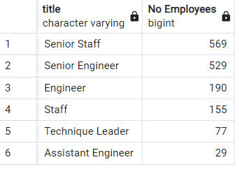

# Pewlett-Hackard-Analysis
## Overview
Pewlett Hackard is a company with an aging employee base slated for retirement. They would like to determine the number of employees retiring along with their titles. In addition, they would like to debut a mentorship program for eligible employees to mitigate the loss of experience from the expected wave of retirements. They are calling the program the "Silver Tsunami". 

---
## Purpose
To determine the number of employees slated for retirement along with their titles and report the employees eligible for the "Silver Tsunami" mentorship program.

---
## Results and Analysis

We are provided a set of tables to work with:
1. [departments](Queries/Data/departments.csv)
2. [department employees](Queries/Data/dept_emp.csv)
3. [employees](Queries/Data/employees.csv)
4. [titles](Queries/Data/titles.csv)
5. [managers](Queries/Data/dept_manager.csv)
6. [salaries](Queries/Data/salaries.csv)

### Entity Relationship Diagram
To visualize the relationship between the different tables, a relationship entity diagram (ERD) was drawn up (below). 

 

From this diagram, it is easy to determine that the employees, titles, and department employees tables will be important for the work ahead. Together, these contain employee numbers, first and last names, birth dates, hire dates, and titles. They can also be joined at the employee number column (emp_no). 

### Retirement Titles
It was determined that those employees born in the years 1952 to 1955 would be most likely to retire in the near future. With this information, a list of employees eligible for retirement with their associated titles was generated by joining the employees and department employees tables at their emp_no columns ([retirement_titles](Queries/Data/retirement_titles.csv)). 

### Retiring Titles
The retirement_titles table contains duplicates due to employee promotions. To remove these, DISTINCT ON was used to create the [unique_titles table](Queries/Data/unique_titles.csv). To determine where the mentorship program should concentrate its efforts, a count of these retiring employees grouped by their titles was performed ([retiring_titles](Queries/Data/retiring_titles.csv)). From this table, we can see that the top positions to replace will be: 
* Senior Engineer (25,916)
* Senior Staff (24,926)
* Engineer (9,285)
* Staff (7,636)

These certainly are worrisome numbers!

### Mentorship Eligibility
Going back to the employees and titles tables, we can once again join these on their emp_no columns along with the dept_emp table to determine the current employees who would be eligible for the mentorship program ([mentorship_eligibility](Queries/Data/mentorship_eligibility.csv)). We are assuming that employees born in 1965 would be the best candidates for mentorship. By filtering for this criteria and then counting the number of employee numbers (shown below), we obtain the number of employees grouped by title eligible to participate in the mentorship program.

From this table, we can see the following: 
* 569 Senior Staff
* 529 Senior Engineers
* 190 Engineers
* 155 Staff

These numbers indicate that there is not enough current employees to fill the positions that will be left open once the wave of retirements start.

---
## Summary

There are about fifty times more employees retiring than there are current staff ready to replace. 25,196 senior engineers and 9,285 engineers are ready for retirement while only 529 and 190 senior engineers and engineers, respectively, are eligible for mentorship. Similarly, 24,926 senior staff and 7,636 staff are slated to retire vs 569 senior staff and 155 staff are eligible for mentorship. It can be concluded that there will be more than enough retirement ready employees to mentor eligible employees. However, a number of positions will still be left to fill once the "silver tsunami" starts.

The mentorship eligibility table shown above only assumes employees born in 1965 are ready for mentorship. It does not take into account the amount of time the employee has been in the company. Employees who are younger but have been in the company for a long period of time could also prove to be valuable resources for training and mentorship. It would then be interesting to widen the birthdate range but filter the hire_date column for employees who have been with the company for over 10 years, for example. By increasing the number of employees eligible for mentorship, the company can start to bridge the large gap that the "silver tsunami" will leave.

Another query that might provide additional insight would be to view the number of employees per department that are ready for retirement. In this way, we'd know in which department to pilot the mentorship program. Lessons learned from this cohort would go on to improve the program going forward.